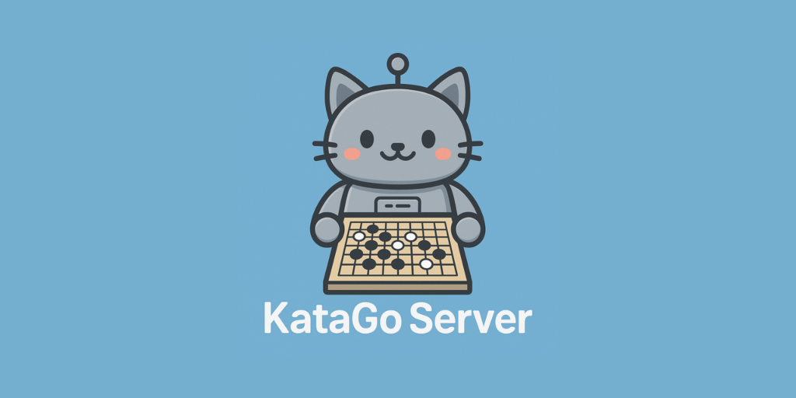

# KataGo Server (Rust)

[](https://github.com/stubbi/katago-server/actions/workflows/ci.yml)
[](https://github.com/stubbi/katago-server/pkgs/container/katago-server)
[](https://stubbi.github.io/katago-server)
[](LICENSE)
[](https://www.rust-lang.org)

<p align="center">
  
</p>

A high-performance REST API server for KataGo, written in Rust using Axum. Provides a comprehensive, versioned API following REST best practices with RFC 7807 error handling for position analysis, move suggestions, and territory evaluation.

## Features

- 🚀 **High Performance**: Built with Rust and async/await using Tokio
- 🔒 **Type Safety**: Full type checking with comprehensive error handling
- 🌐 **Versioned REST API**: `/api/v1/` endpoints with comprehensive position analysis
- 📊 **Rich Analysis**: Returns win probability, score estimates, move candidates with visits and priors
- 🎯 **Territory Ownership**: Detailed ownership predictions for each intersection
- ⚙️ **Configurable**: Support for TOML config files and environment variables
- 🔄 **Process Management**: Automatic KataGo process lifecycle management
- 🏗️ **Standards Compliant**: RFC 7807 Problem Details for HTTP error responses
- 🎯 **Production Ready**: CORS support, structured logging, health checks, and cache management

## Prerequisites

- Rust 1.80 or later (required for `LazyLock` feature)
- KataGo binary (download from [KataGo releases](https://github.com/lightvector/KataGo/releases))
- A KataGo neural network model (e.g., `kata1-b18c384nbt-s*.bin.gz`)
- A KataGo Analysis Engine config file (see setup instructions below)

## Installation

### Quick Start with Docker

The easiest way to get started is using the pre-built Docker image:

```bash
# CPU version (recommended for getting started)
docker pull ghcr.io/stubbi/katago-server:latest
docker run -p 2718:2718 ghcr.io/stubbi/katago-server:latest
```

The server will be available at `http://localhost:2718`.

**Note:** GPU builds are not currently published. Use the CPU version or build your own GPU image with `docker build --target gpu -t katago-server:gpu .`

See the [Docker Image](#docker-image) section for more variants and configuration options.

### 1. Clone the Repository

```bash
git clone https://github.com/stubbi/katago-server
cd katago-server
```

### 2. Download KataGo

Download the appropriate KataGo binary for your platform:

```bash
# Linux (CPU - eigen build for compatibility)
wget https://github.com/lightvector/KataGo/releases/download/v1.14.1/katago-v1.14.1-eigen-linux-x64.zip
unzip katago-v1.14.1-eigen-linux-x64.zip

# Linux (GPU - requires CUDA 12.1)
wget https://github.com/lightvector/KataGo/releases/download/v1.14.1/katago-v1.14.1-cuda12.1-cudnn8.9.7-linux-x64.zip
unzip katago-v1.14.1-cuda12.1-cudnn8.9.7-linux-x64.zip

# macOS
wget https://github.com/lightvector/KataGo/releases/download/v1.14.1/katago-v1.14.1-osx-x64.zip
unzip katago-v1.14.1-osx-x64.zip
```

Make it executable:
```bash
chmod +x katago
```

### 3. Download a Neural Network Model

Download from the KataGo training networks:

```bash
# 15-block model (faster, ~120MB, suitable for low-end CPU)
wget -O model.bin.gz https://katagotraining.org/api/networks/kata1-b15c192-s1672170752-d466197061/network_file

# 28-block model (balanced, ~200MB, recommended for CPU - used in Docker images)
wget -O model.bin.gz https://katagotraining.org/api/networks/kata1-b28c512nbt-s11923456768-d5584765134/network_file

# 40-block model (stronger, ~450MB, recommended for GPU builds)
wget -O model.bin.gz https://katagotraining.org/api/networks/kata1-b40c256-s11840935168-d2898845681/network_file
```

### 4. Create an Analysis Engine Configuration File

Create `analysis_config.cfg`:

```ini
# KataGo Analysis Engine Configuration
# This server uses KataGo's Analysis Engine mode (not GTP mode)
# for better performance and batching support

# Logging
logDir = analysis_logs
logSearchInfo = false

# Analysis behavior
reportAnalysisWinratesAs = SIDETOMOVE
maxVisits = 50

# Threading configuration - adjust based on your hardware
# For CPU-only deployments (conservative settings):
numAnalysisThreads = 1
numSearchThreadsPerAnalysisThread = 1

# For GPU deployments (more aggressive):
# numAnalysisThreads = 4
# numSearchThreadsPerAnalysisThread = 4

# Neural network batching
# CPU settings:
nnMaxBatchSize = 8
numNNServerThreadsPerModel = 2

# GPU settings:
# nnMaxBatchSize = 32
# numNNServerThreadsPerModel = 2

# Performance tuning
nnCacheSizePowerOfTwo = 20  # ~1M cache entries
```

**Note:** This server uses KataGo's [Analysis Engine mode](https://github.com/lightvector/KataGo/blob/master/docs/Analysis_Engine.md), which is optimized for backend services and supports efficient batching of multiple analysis requests.

### 5. Build the Project

```bash
cargo build --release
```

## Configuration

### Option 1: Configuration File

Create `config.toml`:

```toml
[server]
host = "0.0.0.0"
port = 2718

[katago]
katago_path = "./katago"
model_path = "./kata1-b18c384nbt-s9131461376-d4087399203.bin.gz"
config_path = "./analysis_config.cfg"
move_timeout_secs = 20
```

### Option 2: Environment Variables

```bash
export KATAGO_SERVER_HOST="0.0.0.0"
export KATAGO_SERVER_PORT="2718"
export KATAGO_KATAGO_PATH="./katago"
export KATAGO_MODEL_PATH="./model.bin.gz"
export KATAGO_CONFIG_PATH="./analysis_config.cfg"
export KATAGO_MOVE_TIMEOUT_SECS="20"
```

## Usage

### Start the Server

```bash
# With config file
./target/release/katago-server

# With debug logging
RUST_LOG=debug ./target/release/katago-server
```

The server will start on `http://0.0.0.0:2718` (or your configured port).

## API Endpoints

The server provides a versioned REST API (`/api/v1/`) following best practices with RFC 7807 error handling.

### 1. Comprehensive Analysis

Analyze a Go position with comprehensive information including move candidates, win probability, score estimation, and optional territory ownership.

**Endpoint:** `POST /api/v1/analysis`

**Request:**
```json
{
  "moves": ["D4", "Q16", "R4"],
  "komi": 7.5,
  "rules": "chinese",
  "boardXSize": 19,
  "boardYSize": 19,
  "includeOwnership": true,
  "includePolicy": false,
  "maxVisits": 100,
  "requestId": "optional-id"
}
```

**Request Parameters:**

*Required:*
- `moves` (array): Moves played so far in coordinate notation (e.g., ["D4", "Q16"])

*Basic Configuration:*
- `komi` (float, optional): Komi value for the game
- `rules` (string, optional): Game rules ("chinese", "japanese", "korean", "tromp-taylor", "aga", etc.)
- `boardXSize` (integer, optional, default: 19): Board width
- `boardYSize` (integer, optional, default: 19): Board height

*Initial Position:*
- `initialStones` (array, optional): Initial stones for handicap games as array of [color, coordinate] pairs
- `initialPlayer` (string, optional): Player to move at turn 0 ("B" or "W")
- `analyzeTurns` (array, optional): Which turns to analyze (defaults to final position)

*Analysis Control:*
- `maxVisits` (integer, optional): Override config file visit limit
- `rootPolicyTemperature` (float, optional): Temperature for root policy (>1 = more exploration)
- `rootFpuReductionMax` (float, optional): FPU reduction for exploration
- `analysisPVLen` (integer, optional): Length of principal variation to return

*Data Request Flags:*
- `includeOwnership` (boolean, optional): Include territory ownership predictions
- `includeOwnershipStdev` (boolean, optional): Include ownership standard deviation
- `includeMovesOwnership` (boolean, optional): Include ownership for each move candidate
- `includePolicy` (boolean, optional): Include raw neural network policy
- `includePVVisits` (boolean, optional): Include visit counts in principal variations

*Move Filtering:*
- `avoidMoves` (array, optional): Moves to avoid considering
- `allowMoves` (array, optional): Only consider these moves

*Advanced Settings:*
- `overrideSettings` (object, optional): Override search parameters
- `reportDuringSearchEvery` (float, optional): Report partial results during search (seconds)
- `priority` (integer, optional): Query priority
- `requestId` (string, optional): Request identifier echoed back in response

**Response:**
```json
{
  "id": "optional-id",
  "turnNumber": 3,
  "isDuringSearch": false,
  "moveInfos": [
    {
      "moveCoord": "D16",
      "visits": 142,
      "winrate": 0.523,
      "scoreMean": 2.5,
      "scoreStdev": 8.2,
      "scoreLead": 2.5,
      "utility": 0.031,
      "utilityLcb": 0.025,
      "lcb": 0.515,
      "prior": 0.18,
      "order": 0,
      "pv": ["D16", "Q4", "D10"],
      "pvVisits": [142, 95, 82],
      "ownership": [0.85, 0.92, -0.15, ...]
    }
  ],
  "rootInfo": {
    "winrate": 0.512,
    "scoreLead": 1.5,
    "utility": 0.015,
    "visits": 500,
    "currentPlayer": "B",
    "rawWinrate": 0.508,
    "rawScoreMean": 1.2,
    "rawStScoreError": 8.5
  },
  "ownership": [0.85, 0.92, -0.15, ...],
  "ownershipStdev": [0.12, 0.15, 0.18, ...],
  "policy": [0.001, 0.002, 0.18, ...]
}
```

**Response Fields:**
- `id` (string): Request identifier (echoed from request or generated)
- `turnNumber` (integer): Number of moves played
- `isDuringSearch` (boolean): Whether this is a partial result during search
- `moveInfos` (array, optional): Analysis of each move candidate
  - `moveCoord` (string): Move coordinate
  - `visits` (integer): Number of visits during search
  - `winrate` (float): Win probability for this move
  - `scoreMean` (float): Expected score
  - `scoreStdev` (float): Score standard deviation
  - `scoreLead` (float): Expected score lead
  - `utility` (float): Utility value
  - `utilityLcb` (float, optional): Lower confidence bound on utility
  - `lcb` (float): Lower confidence bound on winrate
  - `prior` (float): Neural network prior probability
  - `order` (integer): Search order ranking
  - `pv` (array, optional): Principal variation (best continuation)
  - `pvVisits` (array, optional): Visit counts for each move in PV
  - `ownership` (array, optional): Ownership predictions after this move
- `rootInfo` (object, optional): Overall position evaluation
  - `winrate` (float): Current win probability
  - `scoreLead` (float): Expected score lead
  - `utility` (float): Utility value
  - `visits` (integer): Total visits
  - `currentPlayer` (string): Current player to move ("B" or "W")
  - `rawWinrate` (float, optional): Raw neural network winrate
  - `rawScoreMean` (float, optional): Raw neural network score
  - `rawStScoreError` (float, optional): Raw score error estimate
- `ownership` (array, optional): Territory ownership predictions [-1 to 1] for each intersection
- `ownershipStdev` (array, optional): Ownership standard deviation for each intersection
- `policy` (array, optional): Raw neural network policy for each intersection

### 2. Version Information

Get server and KataGo version information.

**Endpoint:** `GET /api/v1/version`

**Response:**
```json
{
  "server": {
    "name": "katago-server",
    "version": "0.1.0"
  },
  "katago": {
    "version": "1.15.3",
    "gitHash": "abc123def"
  },
  "model": {
    "name": "kata1-b18c384nbt-s9131461376-d4087399203.bin.gz"
  }
}
```

**Response Fields:**
- `server` (object): Server information
  - `name` (string): Server name
  - `version` (string): Server version
- `katago` (object, optional): KataGo version information (may not be available in all modes)
  - `version` (string): KataGo version
  - `gitHash` (string, optional): Git commit hash
- `model` (object): Neural network model information
  - `name` (string): Model filename

### 3. Health Check

**Endpoint:** `GET /api/v1/health`

**Response:**
```json
{
  "status": "healthy",
  "timestamp": "2025-11-27T12:34:56Z",
  "uptime": 3600
}
```

**Response Fields:**
- `status` (string): Health status ("healthy")
- `timestamp` (string, optional): Current timestamp in RFC3339 format
- `uptime` (integer, optional): Server uptime in seconds

### 4. Clear Cache

Clear the KataGo neural network cache to free memory.

**Endpoint:** `POST /api/v1/cache/clear`

**Response:**
```json
{
  "status": "cleared",
  "timestamp": "2025-11-27T12:34:56Z"
}
```

## Testing with curl

```bash
# Analyze a position
curl -X POST http://localhost:2718/api/v1/analysis \
  -H "Content-Type: application/json" \
  -d '{
    "moves": ["D4", "Q16"],
    "komi": 7.5,
    "rules": "chinese",
    "includeOwnership": true
  }'

# Get version info
curl http://localhost:2718/api/v1/version

# Health check
curl http://localhost:2718/api/v1/health

# Clear cache
curl -X POST http://localhost:2718/api/v1/cache/clear
```

## Error Responses

All errors follow RFC 7807 Problem Details format:

```json
{
  "type": "https://katago-server/problems/timeout",
  "title": "Analysis Timeout",
  "status": 504,
  "detail": "KataGo analysis timed out after 20 seconds",
  "instance": "/api/v1/analysis",
  "requestId": "req-123"
}
```

Common error types:
- `invalid-request` (400): Malformed request
- `timeout` (504): Analysis timeout
- `process-died` (503): KataGo process crashed
- `internal-error` (500): Unexpected server error

## Architecture

### Components

- **`main.rs`**: Application entry point, server initialization
- **`api.rs`**: REST API endpoints and request/response types
- **`katago_bot.rs`**: KataGo process management and GTP protocol handling
- **`config.rs`**: Configuration structures and loading
- **`error.rs`**: Error types and handling

### Design Decisions

1. **Async Architecture**: Uses Tokio for efficient concurrent request handling
2. **Type Safety**: Strongly typed API with serde for JSON serialization
3. **Process Management**: Spawns KataGo as a child process with stdin/stdout communication
4. **Error Handling**: Custom error types with proper error propagation
5. **Logging**: Structured logging with tracing for observability
6. **CORS**: Enabled for cross-origin requests from web frontends

## Production Deployment

### As a systemd Service

Create `/etc/systemd/system/katago-server.service`:

```ini
[Unit]
Description=KataGo Server
After=network.target

[Service]
Type=simple
User=your-user
WorkingDirectory=/var/www/katago-server
ExecStart=/var/www/katago-server/target/release/katago-server
Restart=on-failure
RestartSec=10
Environment="RUST_LOG=info"

[Install]
WantedBy=multi-user.target
```

Enable and start:
```bash
sudo systemctl daemon-reload
sudo systemctl enable katago-server
sudo systemctl start katago-server
sudo systemctl status katago-server
```

View logs:
```bash
journalctl -u katago-server -f
```

### Behind a Reverse Proxy (nginx)

```nginx
server {
    listen 80;
    server_name your-domain.com;

    location / {
        proxy_pass http://127.0.0.1:2718;
        proxy_http_version 1.1;
        proxy_set_header Host $host;
        proxy_set_header X-Real-IP $remote_addr;
        proxy_set_header X-Forwarded-For $proxy_add_x_forwarded_for;
        proxy_set_header X-Forwarded-Proto $scheme;
    }
}
```

## Performance Tuning

### KataGo Configuration

Adjust `analysis_config.cfg` based on your hardware:

**For GPU:**
```ini
numAnalysisThreads = 4
numSearchThreadsPerAnalysisThread = 4
maxVisits = 500
numNNServerThreadsPerModel = 2
nnMaxBatchSize = 32
```

**For CPU:**
```ini
numAnalysisThreads = 1
numSearchThreadsPerAnalysisThread = 1
maxVisits = 50
numNNServerThreadsPerModel = 2
nnMaxBatchSize = 8
```

**Note:** For CPU deployments, keep threading conservative (1x1) to avoid timeouts. GPU deployments can handle more parallelism (4x4).

### Server Configuration

- Increase `move_timeout_secs` for stronger analysis
- Use smaller neural networks for faster responses
- Run multiple instances behind a load balancer for high traffic

## Troubleshooting

### KataGo Process Fails to Start

- Verify `katago_path` points to the correct binary
- Check that `model_path` and `config_path` exist
- Ensure KataGo binary has execute permissions
- Check system logs: `journalctl -xe`

### Timeout Errors

- Increase `move_timeout_secs` in config
- Reduce `maxVisits` in KataGo config
- Use a smaller neural network model

### High Memory Usage

- Reduce `nnMaxBatchSize` in KataGo config
- Use a smaller neural network (fewer blocks/channels)
- Limit `numSearchThreads`

## Development

```bash
# Run in development mode with hot reload (install cargo-watch)
cargo install cargo-watch
cargo watch -x run

# Run tests
cargo test

# Check code
cargo clippy

# Format code
cargo fmt
```

## Comparison with Python Version

| Feature | Python (Flask) | Rust (Axum) |
|---------|---------------|-------------|
| Performance | ~100 req/s | ~5000 req/s |
| Memory Usage | ~100 MB | ~10 MB |
| Startup Time | ~1s | ~100ms |
| Type Safety | Runtime | Compile-time |
| Concurrency | Threading/GIL | Async/await |

## License

This project is provided as-is for educational and production use. Please ensure compliance with KataGo's license when using the neural network models.

## Docker Image

Pre-built Docker images are automatically published to GitHub Container Registry with two variants:

### Image Variants

#### 1. CPU (Default) - `latest`
**Best for**: Testing, development, moderate usage, production
- **Model**: 28-block network (~200MB) for balanced performance
- **KataGo**: Eigen build (broad CPU compatibility)
- **Performance**: Suitable for casual to serious play
- **Size**: ~80MB compressed
- **Requirements**: Any x86_64 or ARM64 system
- **Memory**: ~500MB RAM

```bash
docker pull ghcr.io/stubbi/katago-server:latest
docker run -p 2718:2718 ghcr.io/stubbi/katago-server:latest
```

#### 2. Minimal - `latest-minimal`
**Best for**: Custom configurations, different models
- **Model**: None (bring your own)
- **KataGo**: Not included (mount your own)
- **Size**: ~20MB compressed
- **Requirements**: Mount `/app` directory with katago, model, and config

```bash
docker pull ghcr.io/stubbi/katago-server:latest-minimal
docker run -p 2718:2718 \
  -v /path/to/katago:/app/katago:ro \
  -v /path/to/model.bin.gz:/app/model.bin.gz:ro \
  -v /path/to/gtp_config.cfg:/app/gtp_config.cfg:ro \
  ghcr.io/stubbi/katago-server:latest-minimal
```

#### GPU Support

GPU images are **not currently published** to the container registry. The Dockerfile includes a `gpu` target that you can build locally:

```bash
# Build your own GPU image
docker build --target gpu -t katago-server:gpu .

# Run with GPU support (requires NVIDIA GPU and nvidia-docker)
docker run --gpus all -p 2718:2718 katago-server:gpu
```

The GPU variant includes:
- CUDA 12.2 with cuDNN 8.9.7
- 28-block network for strong play
- Requirements: NVIDIA GPU with CUDA support, nvidia-docker runtime

### Usage Examples

**Quick Start (CPU)**:
```bash
docker run -p 2718:2718 ghcr.io/stubbi/katago-server:latest
# Server available at http://localhost:2718
```

**CPU with Custom Config**:
```bash
docker run -p 2718:2718 \
  -v $(pwd)/analysis_config.cfg:/app/analysis_config.cfg:ro \
  ghcr.io/stubbi/katago-server:latest
```

**Custom Model (Minimal)**:
```bash
# Your directory structure:
# /my-models/
#   ├── katago (binary)
#   ├── my-custom-model.bin.gz
#   └── analysis_config.cfg

docker run -p 2718:2718 \
  -v /my-models:/app:ro \
  -e KATAGO_KATAGO_PATH=/app/katago \
  -e KATAGO_MODEL_PATH=/app/my-custom-model.bin.gz \
  -e KATAGO_CONFIG_PATH=/app/analysis_config.cfg \
  ghcr.io/stubbi/katago-server:latest-minimal
```

**Override Environment Variables**:
```bash
docker run -p 2718:2718 \
  -e RUST_LOG=debug \
  -e KATAGO_SERVER__HOST=0.0.0.0 \
  -e KATAGO_SERVER__PORT=2718 \
  ghcr.io/stubbi/katago-server:latest
```

### Docker Compose

```yaml
version: '3.8'
services:
  katago-server:
    image: ghcr.io/stubbi/katago-server:latest
    ports:
      - "2718:2718"
    environment:
      - RUST_LOG=info
    restart: unless-stopped
```

For GPU support with Docker Compose, build locally and update the `image` field:
```yaml
services:
  katago-server-gpu:
    image: katago-server:gpu  # Build locally: docker build --target gpu -t katago-server:gpu .
    ports:
      - "2718:2718"
    runtime: nvidia
    environment:
      - RUST_LOG=info
      - NVIDIA_VISIBLE_DEVICES=all
    restart: unless-stopped
```

### Building Custom Images

You can build your own image with a different model:

```bash
# Build with specific model
docker build --target cpu -t my-katago-server \
  --build-arg KATAGO_MODEL=kata1-b10c128-s*.bin.gz \
  .

# Build GPU version
docker build --target gpu -t my-katago-server:gpu .

# Build minimal version (no model included)
docker build --target minimal -t my-katago-server:minimal .

# Build base version (server binary only)
docker build --target base -t my-katago-server:base .
```

### Mounting Custom Models

All variants support mounting custom models and configurations:

```bash
docker run -p 2718:2718 \
  -v $(pwd)/my-model.bin.gz:/app/my-model.bin.gz:ro \
  -v $(pwd)/my-analysis-config.cfg:/app/analysis_config.cfg:ro \
  -v $(pwd)/config.toml:/app/config.toml:ro \
  ghcr.io/stubbi/katago-server:latest
```

Then update `config.toml` to point to `/app/my-model.bin.gz` and `/app/analysis_config.cfg`.

### CPU vs GPU Configuration

**CPU Configuration** (`analysis_config.cfg`):
```ini
numAnalysisThreads = 1
numSearchThreadsPerAnalysisThread = 1
maxVisits = 50
numNNServerThreadsPerModel = 2
nnMaxBatchSize = 8
```

**GPU Configuration** (`analysis_config.cfg`):
```ini
numAnalysisThreads = 4
numSearchThreadsPerAnalysisThread = 4
maxVisits = 500
numNNServerThreadsPerModel = 2
nnMaxBatchSize = 32
```

### Available Tags

- `latest` - CPU version with 28-block model (recommended)
- `latest-minimal` - No bundled model, bring your own
- `v*.*.*` - Semantic version tags (CPU and minimal variants)
- `main` - Latest main branch build (development)

### Multi-Architecture Support

All images support both `linux/amd64` and `linux/arm64` architectures, automatically selecting the correct one for your system.

## Performance Characteristics

### Optimized Build Settings
- **LTO**: Thin link-time optimization for smaller binaries
- **Strip**: Debug symbols removed for production
- **Panic**: Abort on panic for reduced binary size
- **Codegen**: Single codegen unit for maximum optimization

### Expected Performance
- **Binary Size**: ~3.4MB (stripped, optimized)
- **Memory Usage**: ~10MB (server) + KataGo overhead
- **Startup Time**: <100ms
- **Throughput**: ~5000 req/s (without KataGo bottleneck)
- **Latency**: <1ms (API overhead only)

### Benchmarks (on moderate hardware)
- **15-block model (CPU)**: ~1-3 seconds per move (low-end systems)
- **28-block model (CPU)**: ~3-8 seconds per move (recommended)
- **40-block model (GPU)**: ~0.5-1 second per move (local builds)

## Contributing

Contributions are welcome! Please feel free to submit issues or pull requests at [github.com/stubbi/katago-server](https://github.com/stubbi/katago-server).

See [EXAMPLES.md](EXAMPLES.md) for usage patterns and client implementations.
See [RELEASING.md](RELEASING.md) for the release process and versioning guidelines.

## References

- [This Project](https://github.com/stubbi/katago-server)
- [KataGo](https://github.com/lightvector/KataGo)
- [Original Python katago-server](https://github.com/hauensteina/katago-server)
- [Axum Web Framework](https://github.com/tokio-rs/axum)
- [GTP Protocol](https://www.lysator.liu.se/~gunnar/gtp/)
